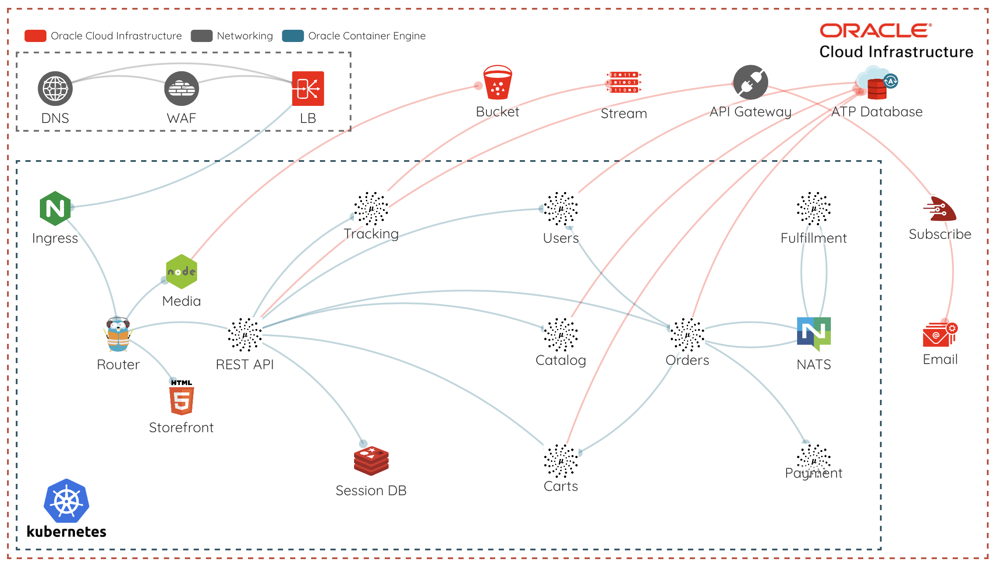

# 

The Micronaut MuShop is a showcase of several [Oracle Cloud Infrastructure](https://cloud.oracle.com/en_US/cloud-infrastructure) services in a unified reference application, written entirely in Micronaut. 

This project is a fork of the [original MuShop implementation](https://github.com/oracle-quickstart/oci-cloudnative) which used different technologies for each individual Microservice applicationµ and is designed as a demonstration of how to use Micronaut to build applications for Oracle Cloud.

The sample application implements an e-commerce platform built as a set of microservices. The accompanying content can be used to get started with cloud native application development on Oracle Cloud Infrastructure.

|  |  |  |  |
|---|---|---|---|

MuShop can be deployed to Oracle Cloud Infrastructure on [Kubernetes](https://kubernetes.io/) with [Helm](https://helm.sh) and [Terraform](https://www.terraform.io), or run locally in [Docker](https://www.docker.com/).

### Oracle Cloud

Use the following Deploy to Oracle Cloud button to use Oracle Cloud Resource Manager to deploy and configure MuShop on OKE. 
#### 

Alternatively you can manually upload the Oracle Cloud Resource Manager [zip file](https://github.com/oracle-quickstart/oci-micronaut/releases/latest/download/mushop-stack-latest.zip).

### Docker

To deploy locally with Docker, follow [these instructions](https://oracle-quickstart.github.io/oci-micronaut/quickstart/dockecompose/). 

### Helm
Micronaut MuShop Complete is a Microservices application built to showcase a cloud-native approach to application development on Oracle Cloud Infrastructure with Micronaut & GraalVM using Oracle's [cloud native](https://www.oracle.com/cloud/cloud-native/) services. MuShop Complete uses a Kubernetes cluster, and can be deployed using the provided `helm` charts. It is recommended to use an Oracle Container Engine for Kubernetes cluster, however other Kubernetes distributions will also work.

The [helm chart documentation](https://oracle-quickstart.github.io/oci-micronaut/quickstart/helm/) walks through the deployment process and various options for customizing the deployment.

If you do not have an Oracle Cloud account yet, you can create a [free trial account](https://signup.oraclecloud.com).

Note that you will have to create and configure the needed Oracle Cloud services manually. For complete automated deployment use the following option [Helm + Terraform](helm--terraform). 

### Helm + Terraform
Deploy the complete MuShop with all Oracle Cloud services automatically using the Terraform scripts. The [terraform documentation](https://oracle-quickstart.github.io/oci-micronaut/quickstart/terraform/) walks through the configuration process and various options for customizing the deployment.

#### Topology

The following diagram shows the topology created by this stack.

## Questions

If you have an issue or a question, please take a look at our [FAQs](./deploy/basic/FAQs.md) or [open an issue](https://github.com/oracle-quickstart/oci-micronaut/issues/new).
