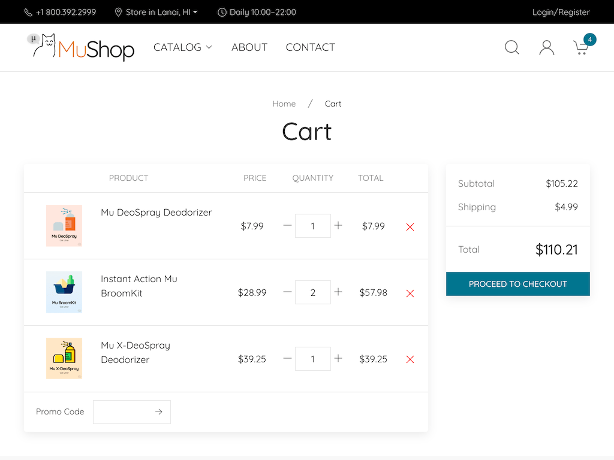
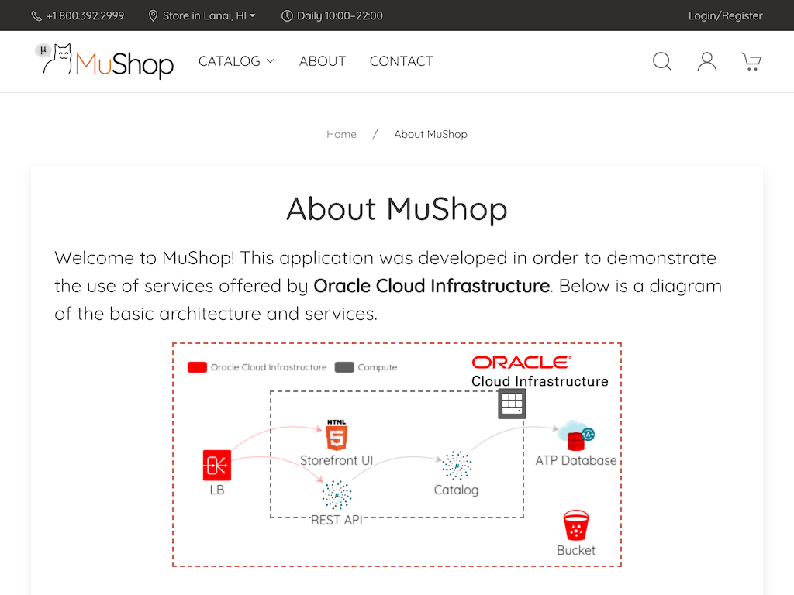

---

This is a Terraform configuration that deploys the MuShop demo on [Oracle Cloud Infrastructure (OCI)][oci].  They are developed by Oracle.

MuShop is a sample 3-tier web application that implements an e-commerce site. It is built to showcase the features of [Oracle Cloud Infrastructure (OCI)][oci]. This sample is designed to run using only the Always Free tier resources. This sample contains the application code as well as the [Terraform][tf] code to create a [Resource Manager][orm] stack. This stack creates all the required resources and configures the application on the created resources.

|  |  |  |  |
|---|---|---|---|

## Getting Started

The steps below guide you through deploying the application on your tenancy using the OCI Resource Manager.

1. Download the latest MuShop [stack](./releases/mushop-basic-stack.zip)
2. [Login](https://console.us-phoenix-1.oraclecloud.com/resourcemanager/stacks/create) to OCI to import the stack
    > `Home > Solutions & Platform > Resource Manager > Stacks > Create Stack`
3. Upload the `mushop-basic-stack.zip` file that was downloaded earlier, and provide a name and description for the stack
4. Configure the stack
   1. **Database Name** - You can choose to provide a database name (optional)
   2. **Node Count** - Select if you want to deploy one or two application instances.
   3. **Availability Domain**  - Select any availability domain to create the resources. If you run in to service limits, you could try another availability domain.
5. Review the information and click Create. (The upload can take a few seconds, after which you will be taken to the newly created stack)
6. On the stack, click on `Terraform Actions > Plan`.
    > A terraform plan will run and tell you what resources will be created.
7. Click on `Terraform Actions > Apply`

All the resources will be created, and the URL to the load balancer will be displayed as `lb_public_url` as in the example below.

```text
Outputs:

autonomous_database_password = <generated>

comments = The application URL will be unavailable for a few minutes after provisioning, while the application is configured

dev = Made with ❤ by Oracle A-Team

lb_public_url = http://xxx.xxx.xxx.xxx 
```

> The application is being deployed to the compute instances asynchronously, and it may take a couple of minutes for the URL to serve the application.

## Deployment Topology

The following diagram shows the topology created by this stack.


To learn more about how you can use this sample to build your own applications, click [here](./deploy/basic/README.md)

## License

Copyright © 2019, Oracle and/or its affiliates. All rights reserved.

The Universal Permissive License (UPL), Version 1.0

[oci]: https://cloud.oracle.com/en_US/cloud-infrastructure
[orm]: https://docs.cloud.oracle.com/iaas/Content/ResourceManager/Concepts/resourcemanager.htm
[tf]: https://www.terraform.io